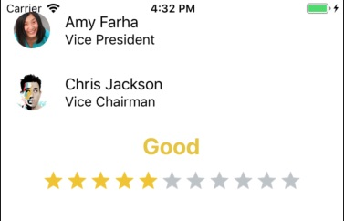

react-native run-ios --simulator="iPhone 6"

# Code nguyên thuỷ

```javascript
import React, {Component} from 'react';
import {Platform, StyleSheet, Text, View} from 'react-native';

const instructions = Platform.select({
  ios: 'Press Cmd+R to reload,\n' + 'Cmd+D or shake for dev menu',
  android:
    'Double tap R on your keyboard to reload,\n' +
    'Shake or press menu button for dev menu',
});

type Props = {};
export default class App extends Component<Props> {
  render() {
    return (
      <View style={styles.container}>
        <Text style={styles.welcome}>OK đấy</Text>
        <Text style={styles.instructions}>To get started, edit App.js</Text>
        <Text style={styles.instructions}>{instructions}</Text>
      </View>
    );
  }
}

const styles = StyleSheet.create({
  container: {
    flex: 1,
    justifyContent: 'center',
    alignItems: 'center',
    backgroundColor: '#F5FCFF',
  },
  welcome: {
    fontSize: 20,
    textAlign: 'center',
    margin: 10,
  },
  instructions: {
    textAlign: 'center',
    color: '#333333',
    marginBottom: 5,
  },
});

```

# Hello World
chú ý cú pháp
```export default class HelloWorldApp extends Component``` để tạo ra main component tương đương với UIViewController

```javascript
import React, { Component } from 'react';
import { Text, View } from 'react-native';

export default class HelloWorldApp extends Component {
  render() {
    return (
      <View style={{ flex: 1, justifyContent: "center", alignItems: "center" }}>
        <Text>Hello, world!</Text>
      </View>
    );
  }
}
```

# Học về Prop
```javascript
import React, { Component } from 'react';
import { AppRegistry, Image } from 'react-native';

export default class Bananas extends Component {
  render() {
    let pic = {
      uri: 'https://upload.wikimedia.org/wikipedia/commons/d/de/Bananavarieties.jpg'
    };
    return (
      <Image source={pic} style={{width: 193, height: 110}}/>
    );
  }
}
```

## Truyền dữ liệu vào prop
```javascript
import React, { Component } from 'react';
import { AppRegistry, Text, View } from 'react-native';

// Tạo một UI Component Greeting
class Greeting extends Component {
  render() {
    return (
      <View style={{alignItems: 'center'}}>
        <Text>Hello {this.props.name} - {this.props.age}</Text>
      </View>
    );
  }
}

export default class LotsOfGreetings extends Component {
  render() {
    return (
      <View style={{alignItems: 'center', top: 50}}>
        <Greeting name='Rexxar' age='10' />
        <Greeting name='Jaina' age='13'/>
        <Greeting name='Valeera' age='15'/>
      </View>
    );
  }
}
```

# Props vs State
Prop là thuộc tính luôn gắn với Component trong cả vòng đời
còn State là trạng thái tại một thời điểm của Component
setInterval() là hàm timer

```javascript
import React, { Component } from 'react';
import { AppRegistry, Text, View } from 'react-native';

class Blink extends Component {

    componentDidMount(){
    // Toggle the state every second
        setInterval(() => (   // Hàm timer
          this.setState(previousState => (
            { isShowingText: !previousState.isShowingText }
          ))
        ), 1000);
     }

    //state object
    state = { isShowingText: true };

  render() {
    if (!this.state.isShowingText) {
      return null;
    }

    return (
      <Text>{this.props.text}</Text>
    );
  }
}

export default class BlinkApp extends Component {
  render() {
    return (
      <View>
        <Blink text='I love to blink' />
        <Blink text='Yes blinking is so great' />
        <Blink text='Why did they ever take this out of HTML' />
        <Blink text='Look at me look at me look at me' />
      </View>
    );
  }
}
```

# Style
Style trong RN là một đối tượng JavaScript được tạo bởi StyleSheet

```javascript
import React, { Component } from 'react';
import { AppRegistry, StyleSheet, Text, View } from 'react-native';

const styles = StyleSheet.create({
  bigBlue: {
    color: 'blue',
    fontWeight: 'bold',
    fontSize: 30,
  },
  red: {
    color: 'red',
  },
});

export default class LotsOfStyles extends Component {
  render() {
    return (
      <View>
        <Text style={styles.red}>just red</Text>
        <Text style={styles.bigBlue}>just bigBlue</Text>
        <Text style={[styles.bigBlue, styles.red]}>bigBlue, then red</Text>
        <Text style={[styles.red, styles.bigBlue]}>red, then bigBlue</Text>
      </View>
    );
  }
}
```

# Debug bằng console.log trong RN

By default on iOS, it logs to the debug pane inside Xcode.

From the IOS simulator press (⌘+D) and press Remote JS Debugging. This will open a resource, http://localhost:8081/debugger-ui on localhost. From there use Chrome Developer tools javascript console to view console.log

```javascript
import React, { Component } from 'react';
import { AppRegistry, View, Dimensions } from 'react-native';

export default class FixedDimensionsBasics extends Component {
  componentDidMount() {
    // Học cách debug bằng console.log ở đây https://stackoverflow.com/questions/30115372/how-to-do-logging-in-react-native
    console.log("window.height = " + Dimensions.get('window').height);
    console.log("window.width = " + Dimensions.get('window').width);
    console.log("screen.height = " + Dimensions.get('screen').height);
    console.log("screen.width = " + Dimensions.get('screen').width);
  }
  render() {
    return (
      <View>
        <View style={{ width: 50, height: 50, backgroundColor: 'powderblue' }} />
        <View style={{ width: 100, height: 100, backgroundColor: 'skyblue' }} />
        <View style={{ width: 150, height: 150, backgroundColor: 'steelblue' }} />
      </View>
    );
  }
}
```

# Flex Dimensions
```javascript
import React, { Component } from 'react';
import { AppRegistry, View } from 'react-native';

export default class FlexDimensionsBasics extends Component {
  render() {
    return (
      // Try removing the `flex: 1` on the parent View.
      // The parent will not have dimensions, so the children can't expand.
      // What if you add `height: 300` instead of `flex: 1`?
      <View style={{flex: 1}}>
        <View style={{flex: 1, backgroundColor: 'powderblue'}} />
        <View style={{flex: 2, backgroundColor: 'skyblue'}} />
        <View style={{flex: 3, backgroundColor: 'steelblue'}} />
      </View>
    );
  }
}
```

## Sử dụng aspectRation để định tỷ lệ giữa width và height
```javascript
import React, { Component } from 'react';
import { AppRegistry, View } from 'react-native';

export default class FlexDirectionBasics extends Component {
  render() {
    return (
      // Try setting `flexDirection` to `column`.
      <View style={{flex: 1, flex: 0.25, flexDirection: 'row'}}>
        <View style={{flex: 1, aspectRatio: 1, backgroundColor: 'powderblue'}} />
        <View style={{flex: 1, aspectRatio: 1, backgroundColor: 'skyblue'}} />
        <View style={{flex: 1, aspectRatio: 1, backgroundColor: 'steelblue'}} />
      </View>
    );
  }
};
```
## Justify content
```javascript
import React, { Component } from 'react';
import { AppRegistry, View } from 'react-native';

export default class JustifyContentBasics extends Component {
  render() {
    return (
      // Try setting `justifyContent` to `center`.
      // Try setting `flexDirection` to `row`.
      <View style={{
        flex: 1,
        flexDirection: 'column',
        justifyContent: 'space-between',
      }}>
        <View style={{flex: 0.2, aspectRatio: 1, backgroundColor: 'powderblue'}} />
        <View style={{flex: 0.2, aspectRatio: 1, backgroundColor: 'skyblue'}} />
        <View style={{flex: 0.2, aspectRatio: 1, backgroundColor: 'steelblue'}} />
      </View>
    );
  }
};
```

# Handling Text Input
```javascript
import React, { Component } from 'react';
import { AppRegistry, Text, TextInput, View } from 'react-native';

export default class PizzaTranslator extends Component {
  constructor(props) {
    super(props);
    this.state = {pizza: ''};  //Tạo một biến lưu trạng thái là text
  }

  render() {
    return (
      <View style={{padding: 10}}>
        <TextInput
          style={{height: 40}}
          placeholder="Type here to translate!"
          onChangeText={(text) => this.setState({pizza: text})}  //Khi người dùng gõ thì cập nhật lại trạng thái text
        />
        <Text style={{padding: 10, fontSize: 42}}>
          {this.state.pizza.split(' ').map((word) => word && '🍕').join(' ')}
        </Text>
      </View>
    );
  }
}
```

# Handling Button


# List Item

## List Icon


```javascript
import React, { Component } from 'react';
import { Text, View } from 'react-native';
import { ListItem } from 'react-native-elements';
const list = [
  {
    title: 'Appointments',
    icon: 'av-timer'
  },
  {
    title: 'Trips',
    icon: 'flight-takeoff'
  }
]

export default class ListApp extends Component {
  render() {
    return (
      <View style={{ marginTop:20,  flex: 1, flexDirection: 'column' }}>
        <View>
          {
            list.map((item, i) => (
              <ListItem
                key={i}
                title={item.title}
                leftIcon={{ name: item.icon }}
              />
            ))
          }
        </View>   
      </View>
    );
  }
}
```

## List with Rating below


```javascript
import React, { Component } from 'react';
import { Text, View } from 'react-native';
import { ListItem } from 'react-native-elements';
import { Rating, AirbnbRating } from 'react-native-elements';


const list = [
  {
    name: 'Amy Farha',
    avatar_url: 'https://s3.amazonaws.com/uifaces/faces/twitter/ladylexy/128.jpg',
    subtitle: 'Vice President'
  },
  {
    name: 'Chris Jackson',
    avatar_url: 'https://s3.amazonaws.com/uifaces/faces/twitter/adhamdannaway/128.jpg',
    subtitle: 'Vice Chairman'
  },
]

export default class ListApp extends Component {
  render() {
    return (
      <View style={{ flex: 1, flexDirection: 'column' }}>
        <View>
          {
            list.map((l, i) => (
              <ListItem
                key={i}
                leftAvatar={{ source: { uri: l.avatar_url } } }
                title={l.name}
                subtitle={l.subtitle}
              />
            ))
          }
        </View>
        <AirbnbRating
          count={11}
          reviews={["Terrible", "Bad", "Meh", "OK", "Good", "Hmm...", "Very Good", "Wow", "Amazing", "Unbelievable", "Jesus"]}
          defaultRating={11}
          size={20}
        />

      </View>
    );
  }
}
```